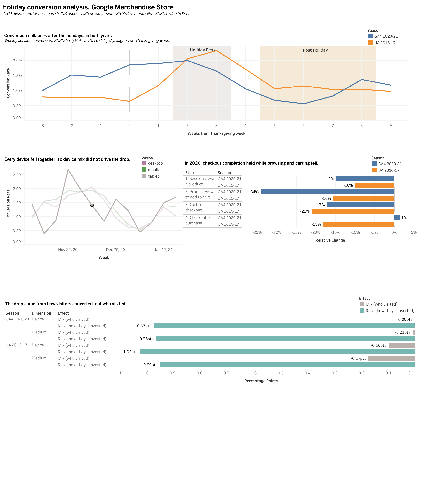

# Consumer Product Usage and KPI Analytics

Spark SQL pipeline and Tableau dashboard for engagement, conversion, and retention reporting on **4.3M real GA4 ecommerce events** from the Google Merchandise Store, with a root-cause analysis of a 53% post-holiday conversion decline that is **replicated on an independent year of data**.

   

Tableau workbook: [tableau/holiday_conversion_dashboard.twbx](tableau/holiday_conversion_dashboard.twbx)

## Key findings

**1. Conversion fell 53% after the holidays, and the same drop happened in a different year.**

Both seasons are aligned on the Monday of Thanksgiving week and compared on the same calendar weeks: the two weeks ending one week before Christmas week (peak) against late December through January (post).

| | 2020-21 (GA4, 4.3M events) | 2016-17 (UA, 903K sessions) |
|---|---|---|
| Peak window | Dec 7 to Dec 20, 2020 | Dec 5 to Dec 18, 2016 |
| Post window | Dec 28, 2020 to Jan 24, 2021 | Dec 26, 2016 to Jan 22, 2017 |
| Peak conversion | 1.83% | 2.19% |
| Post conversion | 0.86% | 1.07% |
| **Relative decline** | **−52.9%** | **−51.1%** |

Two seasons four years apart, measured by two different analytics systems, show nearly identical declines. That makes this a recurring seasonal pattern rather than a 2020-specific event.

**2. Traffic mix did not cause it in either year.** A mix vs rate decomposition splits the conversion change into a shift in *who visited* (mix) and a change in *how they converted* (rate).

| Decline, in conversion percentage points | 2020-21 | 2016-17 |
|---|---|---|
| Total change | −0.97 | −1.12 |
| Device mix effect | −0.00 | −0.10 |
| Channel mix effect | −0.01 | −0.17 |

Device and channel mix explained almost none of the 2020 decline and a small share of the 2016 decline. In both years, conversion fell within every device and channel. The same kinds of visitors kept arriving and simply bought less, which is consistent with gift-buying intent ending after the holidays.

**3. In 2020, the loss happened before checkout.**

| Funnel step, peak → post | 2020-21 | 2016-17 |
|---|---|---|
| Sessions viewing a product | −15% | −10% |
| Product view → add to cart | **−34%** | −16% |
| Cart → checkout | −17% | −21% |
| Checkout → purchase | **+1%** | −18% |

In 2020, browsing and carting dropped sharply while shoppers who reached checkout completed it at the same rate as at peak, which rules out a broken checkout or payment flow. In 2016, checkout completion fell as well.

**4. Holiday demand arrived earlier in 2020.** In 2016, conversion was still low in Thanksgiving week (0.64%) and spiked only in the two weeks before Christmas (2.06% and 2.33%). In 2020, conversion was already elevated about two weeks before Thanksgiving (around 1.5%). This is consistent with the earlier holiday shopping push widely reported in 2020, though this data cannot establish the cause.

**Business implication:** acquisition or channel fixes would not have recovered January conversion. Conversion KPIs for this store need seasonal baselines, so the post-holiday dip is read against the same weeks of prior years instead of against December.

**Robustness:** an initial comparison using fixed four-week windows starting in Thanksgiving week showed a 59% decline for 2020 but only 14% for 2016. The weekly series showed why: 2016's peak arrived later, so those windows placed two low-converting 2016 weeks inside its "peak." Matching on the same calendar weeks removes that artifact. Both window choices agree that the 2020 decline was rate-driven, not mix-driven.

## Data

| Dataset | Coverage | Volume | Role |
|---|---|---|---|
| [`ga4_obfuscated_sample_ecommerce`](https://developers.google.com/analytics/bigquery/web-ecommerce-demo-dataset) | Nov 1, 2020 to Jan 31, 2021 | 4,295,584 events, 360,129 sessions, 270,154 users | Main pipeline and dashboard |
| `google_analytics_sample` (UA / GA360) | Aug 1, 2016 to Aug 1, 2017 | 903,653 sessions | Independent season for replication |

Both are Google's public BigQuery samples from the same store. Both are obfuscated, so some fields contain placeholder values. GA4 and UA define sessions differently, so the comparison focuses on relative changes and funnel shape, not absolute conversion levels.

## Architecture

```
BigQuery GA4 export (nested events)          BigQuery UA export (nested sessions)
   │  extract.py                                │  extract_ua.py
   ▼                                            ▼
data/raw ──► Spark SQL (local)               data/raw_ua ──► 11 ua_fct_sessions
               01 events_clean                                  │
               02 sessions_derived                               │
               03 session_match                                  │
               04 fct_sessions ───────────────┬──────────────────┘
               05 fct_funnel_daily            ▼
               06 fct_users              yoy.py: 10 rca_decomposition + funnel steps
               07 fct_retention_cohort         12 season_weekly (Thanksgiving-aligned)
               08/09 kpi_daily/weekly
   ▼
validate.py (12 SQL assertions) ──► tableau/*.csv ──► Tableau Public
```

## Metric definitions

| Metric | Definition |
|---|---|
| Session | GA4: `user_pseudo_id` + `ga_session_id`. UA: `fullVisitorId` + `visitId` + date |
| Conversion rate | Sessions with ≥1 purchase / all sessions |
| Bounce | Session with ≤1 page_view and no ecommerce events |
| Funnel | Product view → add to cart → checkout → purchase, measured as sessions reaching each step |
| Season week | Weeks since the Monday of Thanksgiving week (Nov 23, 2020 and Nov 21, 2016) |
| New user | First touch on or after 2020-11-01 |
| D7 retention | New users with a session on days 1 to 7 after first session / new users with ≥7 days of observable history |
| Medium | Acquisition medium (GA4 `traffic_source` is user-scoped) |
| Mix effect | Σ (post share − peak share) × peak conversion |
| Rate effect | Σ post share × (post conversion − peak conversion) |

## Data quality

| Check | Result |
|---|---|
| ERROR-level checks passing | 8 of 8 |
| Sessionization match rate vs GA4 native sessions | 97.3% (355,601 derived vs 360,129 GA4 sessions) |
| GA4 duplicate events, null users, null sessions, null devices | 0 |
| UA duplicate sessions | 0 |
| GA4 events with redacted traffic medium | 911,399 (21%) |
| Daily funnel rows where checkouts exceed add-to-cart | 293 of 1,377, consistent with carts resumed from earlier sessions |
| Purchase sessions with no checkout event | 3 |
| Days with event volume more than 3 standard deviations from trailing mean | 1 |

ERROR checks cover key uniqueness, revenue reconciliation between events and sessions, session count reconciliation across marts, funnel bounds, and retention bounds. WARN checks report known characteristics of the obfuscated data without failing the run.

## Run it

```bash
pip install -r requirements.txt          # needs Java 17 for Spark
export GCP_PROJECT=your-project-id       # free BigQuery sandbox project
gcloud auth application-default login
python extract.py && python extract_ua.py
python pipeline.py && python validate.py
python rca.py --baseline 2020-12-07 2020-12-20 --comparison 2020-12-28 2021-01-24
python yoy.py                                       # matched calendar windows
python yoy.py --peak-weeks 0 3 --post-weeks 4 7     # robustness check
```

`pipeline.py --start YYYY-MM-DD --end YYYY-MM-DD` reruns the pipeline for a reporting window.

## Production deployment

In production, an orchestrator (Airflow or a cron scheduler) would run `pipeline.py` then `validate.py`, and trigger a Tableau Server or Tableau Cloud extract refresh through the REST API **only if every ERROR check passes**, so stakeholders never see a dashboard built on data that failed validation. Tableau Public, used here, does not support scheduled refreshes for file-based sources.
